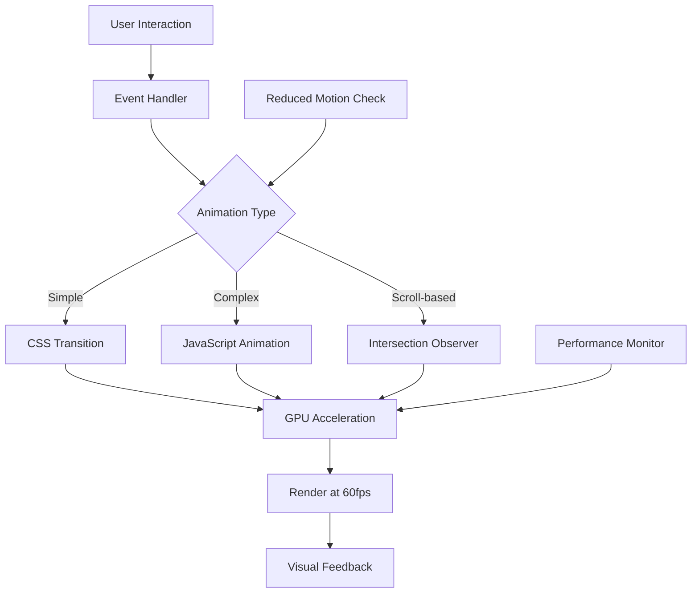
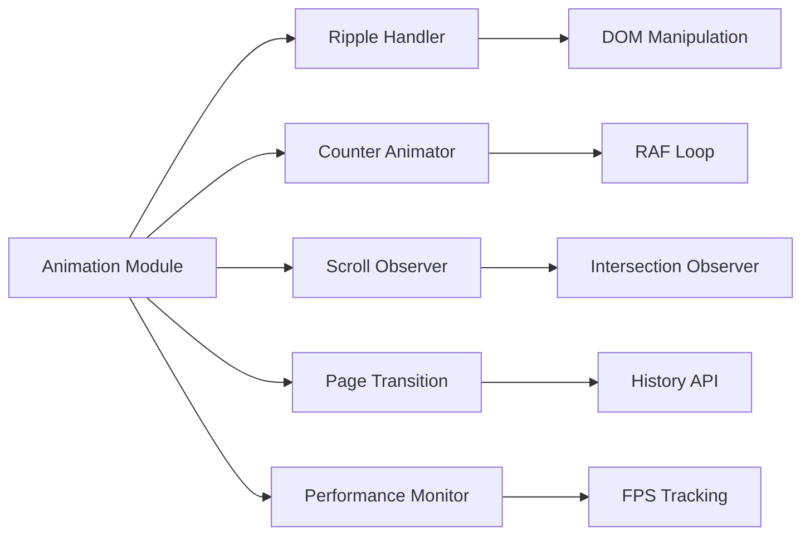

# Design Document: Elegant UI Animations

## Overview

This design document outlines the technical architecture and implementation strategy for adding elegant, performant animations to the FlashWork application. The animation system will enhance user experience through smooth transitions, visual feedback, and progressive disclosure while maintaining 60fps performance across all devices.

The implementation follows a layered approach:
- **CSS Layer**: Core animations using transforms, opacity, and keyframes
- **JavaScript Layer**: Complex interactions (ripple effects, counters, scroll handlers)
- **Integration Layer**: Hooks into existing components and pages

### Design Goals

1. **Performance First**: All animations must maintain 60fps using GPU-accelerated properties
2. **Consistency**: Unified animation language across all pages and components
3. **Accessibility**: Respect `prefers-reduced-motion` for users with motion sensitivity
4. **Progressive Enhancement**: Animations enhance but don't block core functionality
5. **Maintainability**: Centralized animation definitions for easy updates

### Technology Stack

- **CSS3**: Transitions, transforms, keyframe animations
- **Vanilla JavaScript**: Animation utilities, scroll handlers, ripple effects
- **Intersection Observer API**: Efficient scroll-based reveal animations
- **RequestAnimationFrame**: Smooth counter animations and performance monitoring

## Architecture

### File Structure

```
flashwork/frontend/
├── css/
│   ├── animations.css          # Core animation definitions (NEW)
│   ├── transitions.css          # Page transition styles (NEW)
│   ├── loading-states.css       # Skeleton loaders and shimmers (NEW)
│   ├── global.css               # Updated with animation variables
│   ├── components.css           # Updated with hover/interaction states
│   └── [existing files]
├── js/
│   ├── animations/
│   │   ├── ripple.js           # Ripple effect utility (NEW)
│   │   ├── counter.js          # Counter animation utility (NEW)
│   │   ├── scroll-reveal.js    # Scroll-based animations (NEW)
│   │   ├── page-transition.js  # Page navigation transitions (NEW)
│   │   └── performance.js      # Performance monitoring (NEW)
│   ├── utils.js                 # Updated with animation helpers
│   └── [existing files]
└── [existing structure]
```

### Animation System Layers



### CSS Architecture

The CSS animation system uses a three-tier approach:

1. **CSS Custom Properties** (variables for timing, easing, distances)
2. **Utility Classes** (reusable animation classes)
3. **Component-Specific Animations** (targeted enhancements)

### JavaScript Architecture



## Components and Interfaces

### 1. CSS Animation System

#### animations.css

Core animation definitions including:
- Keyframe animations (fade, slide, scale, shimmer)
- Utility classes for common animations
- Timing function definitions
- Animation state classes

**Key Exports:**
- `.fade-in`, `.fade-out`
- `.slide-in-[direction]`, `.slide-out-[direction]`
- `.scale-in`, `.scale-out`
- `.shimmer-effect`
- `.reveal-on-scroll`

#### transitions.css

Page and component transition styles:
- Page enter/exit animations
- Modal open/close transitions
- Dropdown expand/collapse
- Backdrop blur effects

**Key Exports:**
- `.page-transition-enter`, `.page-transition-exit`
- `.modal-transition`
- `.backdrop-blur`

#### loading-states.css

Skeleton loaders and loading indicators:
- Skeleton shapes (text, card, image)
- Shimmer gradient animation
- Spinner alternatives
- Progress indicators

**Key Exports:**
- `.skeleton-[type]`
- `.loading-shimmer`
- `.progress-bar-animated`

### 2. JavaScript Animation Modules

#### ripple.js

```javascript
/**
 * Creates a ripple effect on click
 * @param {HTMLElement} element - Target element
 * @param {MouseEvent} event - Click event
 * @param {Object} options - Configuration options
 */
export function createRipple(element, event, options = {})

/**
 * Initializes ripple effect on all elements with data-ripple attribute
 */
export function initRippleEffects()
```

**Implementation Strategy:**
- Create ripple element on click
- Calculate position from click coordinates
- Animate expansion and fade using CSS
- Remove element after animation completes

#### counter.js

```javascript
/**
 * Animates a number from start to end value
 * @param {HTMLElement} element - Target element
 * @param {number} start - Starting value
 * @param {number} end - Ending value
 * @param {number} duration - Animation duration in ms
 * @param {Function} formatter - Optional value formatter
 */
export function animateCounter(element, start, end, duration, formatter)

/**
 * Initializes counter animations for dashboard stats
 */
export function initCounterAnimations()
```

**Implementation Strategy:**
- Use requestAnimationFrame for smooth increments
- Apply easing function for natural acceleration
- Support currency and number formatting
- Trigger only when element enters viewport

#### scroll-reveal.js

```javascript
/**
 * Observes elements and triggers reveal animations
 * @param {string} selector - CSS selector for elements to observe
 * @param {Object} options - Intersection Observer options
 */
export function initScrollReveal(selector, options)

/**
 * Adds sticky navbar blur effect on scroll
 */
export function initStickyNavbar()

/**
 * Enables smooth scrolling for anchor links
 */
export function initSmoothScroll()
```

**Implementation Strategy:**
- Use Intersection Observer for efficient detection
- Add reveal classes when elements enter viewport
- Support stagger delays for list items
- Handle navbar backdrop blur at scroll threshold

#### page-transition.js

```javascript
/**
 * Applies page transition animation
 * @param {string} direction - 'enter' or 'exit'
 * @param {Function} callback - Function to call after transition
 */
export function transitionPage(direction, callback)

/**
 * Intercepts navigation and adds transitions
 */
export function initPageTransitions()
```

**Implementation Strategy:**
- Intercept link clicks and form submissions
- Apply exit animation to current page
- Navigate to new page
- Apply enter animation to new page
- Maintain browser history

#### performance.js

```javascript
/**
 * Monitors animation performance
 * @returns {Object} Performance metrics
 */
export function monitorPerformance()

/**
 * Detects low-end devices and disables heavy animations
 */
export function detectDeviceCapability()

/**
 * Checks if reduced motion is preferred
 * @returns {boolean}
 */
export function prefersReducedMotion()
```

**Implementation Strategy:**
- Track FPS using requestAnimationFrame
- Detect device capabilities (CPU, GPU)
- Disable non-essential animations on low-end devices
- Respect prefers-reduced-motion media query

### 3. Integration Points

#### Existing Components to Enhance

1. **Buttons** (global.css, components.css)
   - Add hover scale and active press animations
   - Integrate ripple effect via data attribute
   - Smooth color transitions

2. **Cards** (components.css)
   - Hover lift effect (translateY + shadow)
   - Border glow on hover
   - Smooth expansion for expandable cards

3. **Modals** (components.css)
   - Scale + fade entrance
   - Backdrop blur effect
   - Smooth exit animation

4. **Forms** (components.css)
   - Input focus animations
   - Label float effect
   - Validation state transitions

5. **Navbar** (components.css)
   - Sticky blur backdrop on scroll
   - Smooth link hover states
   - Mobile menu slide animation

6. **Toast Notifications** (global.css)
   - Slide in from right
   - Progress bar animation
   - Slide out on dismiss

7. **Dashboard Stats** (client.css, worker-light.css)
   - Counter animations on load
   - Card stagger reveal
   - Chart draw-in effects

## Data Models

### Animation Configuration Object

```javascript
const AnimationConfig = {
  // Timing
  durations: {
    instant: 100,
    fast: 200,
    normal: 300,
    slow: 400,
    verySlow: 600,
    counter: 1000,
    shimmer: 1500
  },
  
  // Easing functions
  easing: {
    easeOut: 'cubic-bezier(0.16, 1, 0.3, 1)',
    easeIn: 'cubic-bezier(0.7, 0, 0.84, 0)',
    easeInOut: 'cubic-bezier(0.65, 0, 0.35, 1)',
    spring: 'cubic-bezier(0.34, 1.56, 0.64, 1)'
  },
  
  // Distances
  distances: {
    small: '5px',
    medium: '20px',
    large: '30px'
  },
  
  // Ripple settings
  ripple: {
    duration: 600,
    opacity: 0.3,
    scale: 2.5
  },
  
  // Scroll reveal settings
  scrollReveal: {
    threshold: 0.1,
    rootMargin: '0px 0px -50px 0px'
  },
  
  // Performance thresholds
  performance: {
    minFPS: 50,
    checkInterval: 1000
  }
}
```

### Animation State Classes

```javascript
const AnimationStates = {
  // Visibility
  'is-visible': 'Element is visible and animated in',
  'is-hidden': 'Element is hidden',
  
  // Loading
  'is-loading': 'Element is in loading state',
  'is-loaded': 'Element has finished loading',
  
  // Interaction
  'is-hovering': 'Element is being hovered',
  'is-active': 'Element is in active/pressed state',
  'is-focused': 'Element has focus',
  
  // Animation
  'is-animating': 'Element is currently animating',
  'animation-paused': 'Animation is paused',
  
  // Reduced motion
  'reduce-motion': 'User prefers reduced motion'
}
```

## Error Handling

### Animation Failure Scenarios

1. **Browser Compatibility**
   - **Issue**: Older browsers may not support modern CSS features
   - **Handling**: Feature detection and graceful degradation
   - **Fallback**: Remove animations, maintain functionality

2. **Performance Degradation**
   - **Issue**: Animations cause frame drops on low-end devices
   - **Handling**: Monitor FPS and disable heavy animations
   - **Fallback**: Reduce to essential feedback only

3. **JavaScript Errors**
   - **Issue**: Animation module fails to load or execute
   - **Handling**: Try-catch blocks around animation code
   - **Fallback**: CSS-only animations continue to work

4. **Intersection Observer Unavailable**
   - **Issue**: Older browsers lack Intersection Observer API
   - **Handling**: Polyfill or fallback to scroll event listener
   - **Fallback**: Show all elements immediately without reveal

### Error Handling Implementation

```javascript
// Example error handling pattern
export function safeAnimate(element, animationFn) {
  try {
    // Check if reduced motion is preferred
    if (prefersReducedMotion()) {
      return; // Skip animation
    }
    
    // Check if element exists
    if (!element) {
      console.warn('Animation target element not found');
      return;
    }
    
    // Execute animation
    animationFn(element);
    
  } catch (error) {
    console.error('Animation error:', error);
    // Ensure element is visible even if animation fails
    element.style.opacity = '1';
    element.style.transform = 'none';
  }
}
```

## Testing Strategy

### Unit Testing

**Focus**: Individual animation functions and utilities

**Test Cases**:
1. Ripple effect creates and removes DOM elements correctly
2. Counter animation calculates intermediate values accurately
3. Scroll reveal observer triggers at correct thresholds
4. Performance monitor detects FPS drops
5. Reduced motion detection works correctly

**Tools**: Jest or Vitest for JavaScript unit tests

### Integration Testing

**Focus**: Animation integration with existing components

**Test Cases**:
1. Button clicks trigger ripple effect
2. Dashboard counters animate on page load
3. Cards reveal on scroll
4. Modals open/close with correct animations
5. Page transitions work with navigation
6. Toast notifications slide in/out correctly

**Tools**: Playwright or Cypress for E2E tests

### Visual Regression Testing

**Focus**: Ensure animations don't break layouts

**Test Cases**:
1. Capture screenshots at animation keyframes
2. Compare before/after animation states
3. Test across different viewport sizes
4. Verify no layout shift during animations

**Tools**: Percy or Chromatic for visual testing

### Performance Testing

**Focus**: Ensure animations maintain 60fps

**Test Cases**:
1. Monitor FPS during heavy animation sequences
2. Test on low-end device profiles
3. Measure animation frame timing
4. Check for memory leaks in long-running animations
5. Verify GPU acceleration is active

**Tools**: Chrome DevTools Performance tab, Lighthouse

### Accessibility Testing

**Focus**: Respect user preferences and maintain usability

**Test Cases**:
1. Verify reduced motion disables animations
2. Ensure keyboard navigation works during animations
3. Test screen reader compatibility
4. Verify focus states remain visible
5. Check color contrast during transitions

**Tools**: axe DevTools, NVDA/JAWS screen readers

### Browser Compatibility Testing

**Test Matrix**:
- Chrome (latest, -1, -2 versions)
- Firefox (latest, -1 versions)
- Safari (latest, -1 versions)
- Edge (latest)
- Mobile Safari (iOS 14+)
- Chrome Mobile (Android 10+)

**Fallback Testing**:
- Test with CSS features disabled
- Test with JavaScript disabled
- Test with Intersection Observer polyfill

## Implementation Approach

### Phase 1: Foundation (Requirements 1, 10, 12)

**Goal**: Establish core animation infrastructure

**Tasks**:
1. Create animations.css with keyframes and utility classes
2. Add CSS custom properties for timing and easing
3. Implement performance.js for monitoring and reduced motion detection
4. Remove all emoji usage from HTML and CSS
5. Add feature detection and fallbacks

**Deliverables**:
- animations.css
- performance.js
- Updated global.css with animation variables
- Emoji removal complete

### Phase 2: Core Interactions (Requirements 3, 4, 8)

**Goal**: Add fundamental interaction animations

**Tasks**:
1. Implement ripple.js for button effects
2. Add hover animations to buttons and cards
3. Update components.css with interaction states
4. Implement toast notification animations
5. Add modal open/close transitions

**Deliverables**:
- ripple.js
- Updated components.css
- Enhanced button and card interactions
- Animated toast system

### Phase 3: Page Transitions (Requirements 2, 7)

**Goal**: Smooth navigation and modal experiences

**Tasks**:
1. Create page-transition.js
2. Implement transitions.css
3. Add modal scale + fade animations
4. Integrate with existing navigation
5. Add backdrop blur effects

**Deliverables**:
- page-transition.js
- transitions.css
- Smooth page navigation
- Enhanced modal experience

### Phase 4: Loading States (Requirement 5)

**Goal**: Elegant loading indicators

**Tasks**:
1. Create loading-states.css
2. Design skeleton loaders for cards, lists, text
3. Implement shimmer effect
4. Replace existing loading spinners
5. Add fade transitions between loading and loaded states

**Deliverables**:
- loading-states.css
- Skeleton loader components
- Shimmer animation

### Phase 5: Dashboard Enhancements (Requirements 6, 9)

**Goal**: Dynamic dashboard experience

**Tasks**:
1. Implement counter.js for stat animations
2. Create scroll-reveal.js for progressive disclosure
3. Add stagger animations for lists
4. Implement sticky navbar blur
5. Add smooth scrolling

**Deliverables**:
- counter.js
- scroll-reveal.js
- Animated dashboard stats
- Scroll-based reveals

### Phase 6: Cross-Page Integration (Requirement 11)

**Goal**: Consistent animations everywhere

**Tasks**:
1. Apply animations to landing page
2. Apply animations to client dashboard
3. Apply animations to worker dashboard
4. Apply animations to job pages
5. Apply animations to wallet pages
6. Test consistency across all pages

**Deliverables**:
- All pages enhanced with animations
- Consistent animation language
- Updated documentation

### Phase 7: Testing and Optimization

**Goal**: Ensure quality and performance

**Tasks**:
1. Write unit tests for animation utilities
2. Perform visual regression testing
3. Conduct performance testing
4. Test accessibility compliance
5. Test browser compatibility
6. Optimize based on findings

**Deliverables**:
- Test suite
- Performance report
- Accessibility audit
- Browser compatibility matrix

## Performance Optimization Strategies

### 1. GPU Acceleration

**Strategy**: Use transform and opacity exclusively for animations

```css
/* Good - GPU accelerated */
.animated {
  transform: translateY(-5px);
  opacity: 0.8;
}

/* Bad - triggers layout recalculation */
.animated {
  top: -5px;
  height: 200px;
}
```

### 2. Will-Change Property

**Strategy**: Use sparingly for elements about to animate

```css
.button:hover {
  will-change: transform;
}

.button:not(:hover) {
  will-change: auto; /* Remove when not needed */
}
```

### 3. Animation Throttling

**Strategy**: Limit concurrent animations

```javascript
const animationQueue = [];
const MAX_CONCURRENT = 5;

function queueAnimation(fn) {
  if (animationQueue.length < MAX_CONCURRENT) {
    fn();
  } else {
    animationQueue.push(fn);
  }
}
```

### 4. Intersection Observer

**Strategy**: Only animate elements in viewport

```javascript
const observer = new IntersectionObserver((entries) => {
  entries.forEach(entry => {
    if (entry.isIntersecting) {
      entry.target.classList.add('animate');
      observer.unobserve(entry.target); // Animate once
    }
  });
});
```

### 5. RequestAnimationFrame

**Strategy**: Sync animations with browser repaint

```javascript
function animate() {
  // Update animation state
  updateAnimationState();
  
  // Continue if not complete
  if (!isComplete) {
    requestAnimationFrame(animate);
  }
}

requestAnimationFrame(animate);
```

### 6. CSS Containment

**Strategy**: Isolate animation impact

```css
.animated-card {
  contain: layout style paint;
}
```

### 7. Debouncing Scroll Events

**Strategy**: Reduce scroll handler frequency

```javascript
let scrollTimeout;
window.addEventListener('scroll', () => {
  clearTimeout(scrollTimeout);
  scrollTimeout = setTimeout(handleScroll, 100);
});
```

## Accessibility Considerations

### Reduced Motion Support

```css
@media (prefers-reduced-motion: reduce) {
  *,
  *::before,
  *::after {
    animation-duration: 0.01ms !important;
    animation-iteration-count: 1 !important;
    transition-duration: 0.01ms !important;
  }
}
```

### Focus Visibility

```css
.button:focus-visible {
  outline: 2px solid var(--accent-blue);
  outline-offset: 2px;
  /* Ensure outline is visible during animations */
}
```

### Screen Reader Announcements

```javascript
function announceToScreenReader(message) {
  const announcement = document.createElement('div');
  announcement.setAttribute('role', 'status');
  announcement.setAttribute('aria-live', 'polite');
  announcement.className = 'sr-only';
  announcement.textContent = message;
  document.body.appendChild(announcement);
  
  setTimeout(() => announcement.remove(), 1000);
}
```

## Browser Compatibility

### Feature Detection

```javascript
const features = {
  intersectionObserver: 'IntersectionObserver' in window,
  backdropFilter: CSS.supports('backdrop-filter', 'blur(10px)'),
  transforms: CSS.supports('transform', 'translateX(0)'),
  customProperties: CSS.supports('--custom', '0')
};

// Apply fallbacks based on feature support
if (!features.backdropFilter) {
  document.body.classList.add('no-backdrop-filter');
}
```

### Polyfills

```javascript
// Intersection Observer polyfill for older browsers
if (!('IntersectionObserver' in window)) {
  import('intersection-observer').then(() => {
    initScrollReveal();
  });
}
```

### Graceful Degradation

```css
/* Modern browsers */
.modal-backdrop {
  backdrop-filter: blur(10px);
  background-color: rgba(0, 0, 0, 0.5);
}

/* Fallback for browsers without backdrop-filter */
.no-backdrop-filter .modal-backdrop {
  background-color: rgba(0, 0, 0, 0.8);
}
```

## CSS Custom Properties

```css
:root {
  /* Animation Durations */
  --duration-instant: 100ms;
  --duration-fast: 200ms;
  --duration-normal: 300ms;
  --duration-slow: 400ms;
  --duration-very-slow: 600ms;
  --duration-counter: 1000ms;
  --duration-shimmer: 1500ms;
  
  /* Easing Functions */
  --ease-out: cubic-bezier(0.16, 1, 0.3, 1);
  --ease-in: cubic-bezier(0.7, 0, 0.84, 0);
  --ease-in-out: cubic-bezier(0.65, 0, 0.35, 1);
  --ease-spring: cubic-bezier(0.34, 1.56, 0.64, 1);
  
  /* Animation Distances */
  --distance-small: 5px;
  --distance-medium: 20px;
  --distance-large: 30px;
  
  /* Ripple Effect */
  --ripple-duration: 600ms;
  --ripple-opacity: 0.3;
  
  /* Shimmer Effect */
  --shimmer-color-start: rgba(255, 255, 255, 0);
  --shimmer-color-mid: rgba(255, 255, 255, 0.5);
  --shimmer-color-end: rgba(255, 255, 255, 0);
}
```

## Integration with Existing Code

### Updating global.css

```css
/* Add to existing button styles */
.btn {
  /* ... existing styles ... */
  transition: transform var(--duration-fast) var(--ease-out),
              box-shadow var(--duration-fast) var(--ease-out),
              background-color var(--duration-fast) var(--ease-out);
  position: relative;
  overflow: hidden; /* For ripple effect */
}

.btn:hover {
  transform: scale(1.05);
}

.btn:active {
  transform: scale(0.95);
}
```

### Updating components.css

```css
/* Add to existing card styles */
.job-card {
  /* ... existing styles ... */
  transition: transform var(--duration-normal) var(--ease-out),
              box-shadow var(--duration-normal) var(--ease-out),
              border-color var(--duration-normal) var(--ease-out);
}

.job-card:hover {
  transform: translateY(var(--distance-small));
  box-shadow: 0 12px 32px rgba(0, 0, 0, 0.15);
  border-color: var(--accent-blue);
}
```

### Updating HTML Templates

```html
<!-- Add data-ripple attribute to buttons -->
<button class="btn btn-primary" data-ripple>
  Click Me
</button>

<!-- Add data-reveal attribute for scroll animations -->
<div class="job-card" data-reveal>
  <!-- Card content -->
</div>

<!-- Add data-counter for animated numbers -->
<div class="stat-value" data-counter data-target="1250">0</div>
```

### Updating JavaScript Initialization

```javascript
// In main.js or app initialization
import { initRippleEffects } from './animations/ripple.js';
import { initScrollReveal } from './animations/scroll-reveal.js';
import { initCounterAnimations } from './animations/counter.js';
import { initPageTransitions } from './animations/page-transition.js';
import { prefersReducedMotion } from './animations/performance.js';

document.addEventListener('DOMContentLoaded', () => {
  // Check for reduced motion preference
  if (!prefersReducedMotion()) {
    initRippleEffects();
    initScrollReveal('[data-reveal]');
    initCounterAnimations();
    initPageTransitions();
  }
  
  // Initialize other app features
  // ...
});
```

## Maintenance and Extensibility

### Adding New Animations

1. **Define in animations.css**:
```css
@keyframes new-animation {
  from { /* start state */ }
  to { /* end state */ }
}

.new-animation-class {
  animation: new-animation var(--duration-normal) var(--ease-out);
}
```

2. **Create utility function** (if complex):
```javascript
export function applyNewAnimation(element, options = {}) {
  // Implementation
}
```

3. **Document in this design doc**

### Updating Animation Timing

All timing is centralized in CSS custom properties. To adjust globally:

```css
:root {
  --duration-normal: 400ms; /* Changed from 300ms */
}
```

### Debugging Animations

```javascript
// Enable animation debugging
window.DEBUG_ANIMATIONS = true;

if (window.DEBUG_ANIMATIONS) {
  console.log('Animation triggered:', animationName);
  console.log('Element:', element);
  console.log('Duration:', duration);
}
```

## Summary

This design provides a comprehensive, performant, and accessible animation system for FlashWork. The implementation prioritizes:

1. **Performance**: GPU-accelerated transforms, efficient observers, FPS monitoring
2. **Consistency**: Centralized definitions, reusable utilities, unified timing
3. **Accessibility**: Reduced motion support, focus management, screen reader compatibility
4. **Maintainability**: Modular architecture, clear documentation, extensible patterns

The phased implementation approach ensures steady progress while maintaining application stability. Each phase builds on the previous, allowing for iterative testing and refinement.
